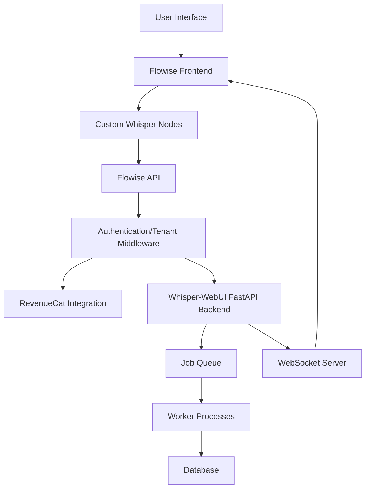

# Multi-Tenant Architecture with Flowise and Whisper-WebUI

This document outlines the architecture for implementing a multi-tenant, subscription-based system using Flowise (which includes React Flow) as the frontend and the existing Whisper-WebUI FastAPI backend.

## Architecture Overview



## Key Components

### 1. Frontend Layer

- **Flowise Frontend**: Provides the visual workflow builder using React Flow
- **Custom Nodes**: Custom components for Whisper transcription, VAD, diarization, etc.
- **User Interface**: Customized UI for managing workflows, jobs, and subscriptions

### 2. Authentication & Multi-Tenancy Layer

- **Authentication Middleware**: Handles user authentication and API key validation
- **Tenant Isolation**: Ensures data and workflows are isolated between tenants
- **Role-Based Access Control**: Controls access to features based on user roles

### 3. Subscription Management

- **RevenueCat Integration**: Manages subscription plans and payments
- **Feature Gating**: Controls access to features based on subscription tier
- **Usage Tracking**: Monitors resource usage for billing purposes

### 4. Backend Processing

- **Whisper-WebUI Backend**: Handles transcription and audio processing
- **Job Queue**: Manages asynchronous processing of transcription jobs
- **Worker Processes**: Executes transcription jobs in the background
- **Database**: Stores user data, job information, and workflow configurations

### 5. Real-Time Communication

- **WebSocket Server**: Provides real-time updates on job status
- **Job Polling**: Fallback mechanism for checking job status

## Data Flow

1. User creates a workflow in the Flowise interface
2. Workflow is saved to the database with tenant information
3. User uploads audio file and starts processing
4. Backend validates subscription status and tenant permissions
5. Job is queued for processing
6. Worker processes the job using Whisper and other components
7. Real-time updates are sent via WebSocket
8. Results are stored in the database with tenant isolation
9. User can access and download results

## Multi-Tenant Database Schema

```
Tenants
- id (PK)
- name
- subscription_tier
- subscription_id (RevenueCat)
- created_at

Users
- id (PK)
- email
- hashed_password
- tenant_id (FK)
- role
- created_at

Jobs
- id (PK)
- user_id (FK)
- tenant_id (FK)
- job_type
- status
- result
- error
- created_at
- updated_at

Workflows
- id (PK)
- name
- tenant_id (FK)
- user_id (FK)
- config (JSON)
- created_at
- updated_at

Files
- id (PK)
- name
- path
- size
- user_id (FK)
- tenant_id (FK)
- created_at
```

## Subscription Tiers and Feature Access

| Feature | Basic | Premium | Enterprise |
|---------|-------|---------|------------|
| Max File Size | 100MB | 500MB | 1GB |
| Concurrent Jobs | 2 | 5 | 10 |
| Available Models | tiny, base | tiny, base, small, medium | All models |
| Diarization | No | Yes | Yes |
| BGM Separation | No | Yes | Yes |
| Translation | Limited | Yes | Yes |
| Storage | 5GB | 20GB | 100GB |
| Custom Workflows | 5 | 20 | Unlimited |

## Implementation Considerations

1. **Tenant Isolation**: Ensure complete data isolation between tenants
2. **Scalability**: Design for horizontal scaling of worker processes
3. **Error Handling**: Implement robust error handling and job retry mechanisms
4. **Monitoring**: Add comprehensive logging and monitoring
5. **Security**: Implement proper authentication, authorization, and data encryption
