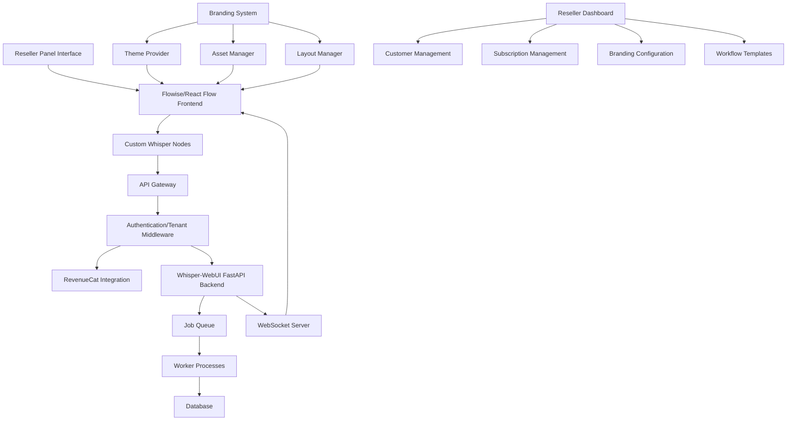
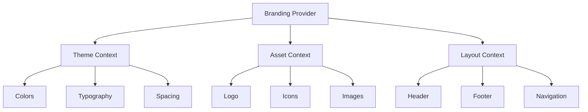

# Reseller Panel Architecture with Hot-Swappable Branding System

This document outlines the architecture for implementing a reseller panel interface with multi-tenant capabilities and a hot-swappable branding system, using Flowise/React Flow as the frontend and the existing Whisper-WebUI FastAPI backend.

## Architecture Overview



## Hot-Swappable Branding System

The branding system works similarly to i18n, but instead of language strings, it manages branding elements:



## Multi-Tenant Hierarchy with Branding

```
Resellers
├── Branding Configuration
└── Customers (Tenants)
    ├── Inherited Branding
    └── Users
        └── Workflows
            └── Jobs
```

## Key Components

### 1. Hot-Swappable Branding System

- **Theme Provider**: Manages colors, typography, and spacing
- **Asset Manager**: Handles logos, icons, and images
- **Layout Manager**: Controls header, footer, and navigation layouts
- **Branding Configuration**: Interface for resellers to configure branding
- **Branding API**: Endpoints for retrieving branding configuration

### 2. Branding Implementation

- **Branding Context**: React context for providing branding to components
- **Styled Components**: Theme-aware components that adapt to branding
- **Asset CDN**: Content delivery network for branding assets
- **Dynamic CSS**: Generated CSS based on branding configuration
- **White-Label Domain Support**: Custom domains for each reseller

### 3. Reseller Panel

- **Reseller Dashboard**: Overview of all customers, usage, and revenue
- **Customer Management**: Add, edit, and manage customer accounts
- **Subscription Management**: Manage subscription plans and pricing
- **Branding Configuration**: Interface for configuring branding elements
- **Workflow Templates**: Create and manage templates for customers

### 4. Customer Portal (Tenant-specific)

- **Branded Interface**: Interface with reseller's branding applied
- **Workflow Builder**: Flowise/React Flow interface for creating transcription workflows
- **Job Management**: View and manage transcription jobs
- **Results Viewer**: View and download transcription results

### 5. Authentication & Multi-Tenancy Layer

- **Multi-level Authentication**: Handles authentication for resellers, tenants, and users
- **Tenant Isolation**: Ensures data and workflows are isolated between tenants
- **Branding Resolution**: Determines which branding to apply based on tenant

## Branding Database Schema

```
Resellers
- id (PK)
- name
- email
- commission_rate
- domain
- created_at

BrandingConfigurations
- id (PK)
- reseller_id (FK)
- name
- is_default
- created_at
- updated_at

BrandingThemes
- id (PK)
- branding_configuration_id (FK)
- primary_color
- secondary_color
- accent_color
- text_color
- background_color
- font_family
- heading_font_family
- button_style
- border_radius
- created_at

BrandingAssets
- id (PK)
- branding_configuration_id (FK)
- logo_url
- favicon_url
- login_background_url
- email_header_url
- created_at

BrandingLayouts
- id (PK)
- branding_configuration_id (FK)
- header_type
- footer_type
- navigation_type
- dashboard_layout
- created_at

BrandingTexts
- id (PK)
- branding_configuration_id (FK)
- company_name
- tagline
- copyright_text
- support_email
- terms_url
- privacy_url
- created_at

Tenants (Customers)
- id (PK)
- name
- reseller_id (FK)
- branding_configuration_id (FK)
- subscription_tier
- subscription_id (RevenueCat)
- created_at
```

## Branding Resolution Flow

1. User accesses the application (either directly or via custom domain)
2. System determines the tenant context from:
   - Custom domain mapping
   - Subdomain
   - URL path
   - Login credentials
3. Tenant context is used to determine the reseller
4. Reseller's branding configuration is loaded
5. Branding provider is initialized with the configuration
6. All UI components render using the provided branding

## Implementation Approach

### Frontend Implementation

```jsx
// BrandingProvider.jsx
import React, { createContext, useContext, useEffect, useState } from 'react';
import { ThemeProvider } from 'styled-components';

const BrandingContext = createContext();

export const useBranding = () => useContext(BrandingContext);

export const BrandingProvider = ({ children, tenantId }) => {
  const [branding, setBranding] = useState(null);
  const [loading, setLoading] = useState(true);
  
  useEffect(() => {
    const fetchBranding = async () => {
      try {
        const response = await fetch(`/api/branding/resolve?tenantId=${tenantId}`);
        const data = await response.json();
        setBranding(data);
      } catch (error) {
        console.error('Failed to load branding:', error);
        // Load fallback branding
        setBranding(defaultBranding);
      } finally {
        setLoading(false);
      }
    };
    
    fetchBranding();
  }, [tenantId]);
  
  if (loading) {
    return <LoadingScreen />;
  }
  
  const theme = {
    colors: {
      primary: branding.theme.primaryColor,
      secondary: branding.theme.secondaryColor,
      accent: branding.theme.accentColor,
      text: branding.theme.textColor,
      background: branding.theme.backgroundColor,
    },
    typography: {
      fontFamily: branding.theme.fontFamily,
      headingFontFamily: branding.theme.headingFontFamily,
    },
    spacing: {
      unit: 8,
      borderRadius: branding.theme.borderRadius,
    },
  };
  
  return (
    <BrandingContext.Provider value={{ 
      assets: branding.assets,
      layout: branding.layout,
      texts: branding.texts,
    }}>
      <ThemeProvider theme={theme}>
        {children}
      </ThemeProvider>
    </BrandingContext.Provider>
  );
};
```

### Backend Implementation

```python
# In FastAPI backend
from fastapi import Depends, FastAPI, HTTPException
from sqlalchemy.orm import Session

@app.get("/api/branding/resolve")
async def resolve_branding(
    tenant_id: str = None,
    domain: str = None,
    db: Session = Depends(get_db)
):
    """Resolve branding configuration based on tenant ID or domain"""
    if not tenant_id and not domain:
        raise HTTPException(status_code=400, detail="Either tenant_id or domain must be provided")
    
    if tenant_id:
        # Resolve by tenant ID
        tenant = db.query(Tenant).filter(Tenant.id == tenant_id).first()
        if not tenant:
            raise HTTPException(status_code=404, detail="Tenant not found")
        
        reseller_id = tenant.reseller_id
        branding_id = tenant.branding_configuration_id
    else:
        # Resolve by domain
        reseller = db.query(Reseller).filter(Reseller.domain == domain).first()
        if not reseller:
            raise HTTPException(status_code=404, detail="Domain not registered")
        
        reseller_id = reseller.id
        # Get default branding for reseller
        branding = db.query(BrandingConfiguration).filter(
            BrandingConfiguration.reseller_id == reseller_id,
            BrandingConfiguration.is_default == True
        ).first()
        branding_id = branding.id if branding else None
    
    # If no specific branding is set, get the default for the reseller
    if not branding_id:
        branding = db.query(BrandingConfiguration).filter(
            BrandingConfiguration.reseller_id == reseller_id,
            BrandingConfiguration.is_default == True
        ).first()
        if not branding:
            raise HTTPException(status_code=404, detail="No branding configuration found")
        branding_id = branding.id
    
    # Get all branding components
    theme = db.query(BrandingTheme).filter(BrandingTheme.branding_configuration_id == branding_id).first()
    assets = db.query(BrandingAsset).filter(BrandingAsset.branding_configuration_id == branding_id).first()
    layout = db.query(BrandingLayout).filter(BrandingLayout.branding_configuration_id == branding_id).first()
    texts = db.query(BrandingText).filter(BrandingText.branding_configuration_id == branding_id).first()
    
    return {
        "theme": theme.to_dict() if theme else {},
        "assets": assets.to_dict() if assets else {},
        "layout": layout.to_dict() if layout else {},
        "texts": texts.to_dict() if texts else {},
    }
```

## Implementation Considerations

1. **Performance**: Cache branding configurations to minimize database queries
2. **Fallback Mechanism**: Implement fallback branding if configuration is missing
3. **Asset Optimization**: Use CDN for branding assets with proper caching
4. **Preview Capability**: Allow resellers to preview branding changes before applying
5. **Inheritance**: Support inheritance of branding elements from reseller to tenant
6. **Validation**: Validate branding configurations for accessibility and usability
