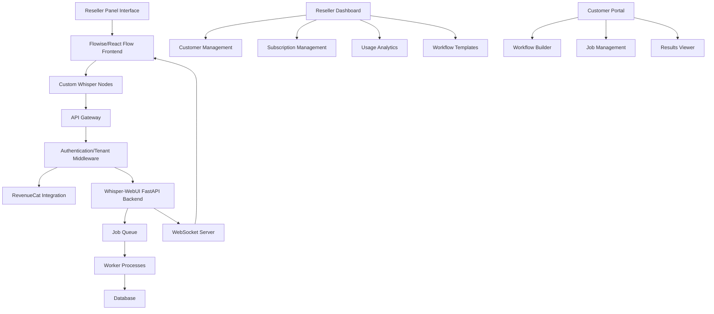

# Reseller Panel Architecture with Multi-Tenant Implementation

This document outlines the architecture for implementing a reseller panel interface with multi-tenant capabilities, using Flowise (which includes React Flow) as the frontend and the existing Whisper-WebUI FastAPI backend.

## Architecture Overview



## Multi-Tenant Hierarchy

```
Resellers
└── Customers (Tenants)
    └── Users
        └── Workflows
            └── Jobs
```

## Key Components

### 1. Reseller Panel

- **Reseller Dashboard**: Overview of all customers, usage, and revenue
- **Customer Management**: Add, edit, and manage customer accounts
- **Subscription Management**: Manage subscription plans and pricing
- **Usage Analytics**: Monitor resource usage across customers
- **Workflow Templates**: Create and manage templates for customers

### 2. Customer Portal (Tenant-specific)

- **Workflow Builder**: Flowise/React Flow interface for creating transcription workflows
- **Job Management**: View and manage transcription jobs
- **Results Viewer**: View and download transcription results
- **User Management**: Manage users within the tenant

### 3. Authentication & Multi-Tenancy Layer

- **Multi-level Authentication**: Handles authentication for resellers, tenants, and users
- **Tenant Isolation**: Ensures data and workflows are isolated between tenants
- **Role-Based Access Control**: Controls access based on roles (reseller, admin, user)

### 4. Subscription Management

- **RevenueCat Integration**: Manages subscription plans and payments
- **Reseller Commission Structure**: Tracks and calculates reseller commissions
- **Feature Gating**: Controls access to features based on subscription tier

### 5. Backend Processing

- **Shared Backend**: Single Whisper-WebUI backend serving all tenants
- **Tenant-aware Processing**: All processing includes tenant context
- **Resource Allocation**: Manages resources based on tenant subscription level

## Data Flow for Job Processing

1. Customer creates a workflow in their tenant-specific Flowise interface
2. Workflow is saved to the database with tenant information
3. Customer uploads audio file and starts processing
4. Backend validates subscription status and tenant permissions
5. Job is queued for processing with tenant context
6. Worker processes the job using Whisper and other components
7. Real-time updates are sent via WebSocket to the specific tenant
8. Results are stored in the database with tenant isolation
9. Customer can access and download results

## Multi-Tenant Database Schema

```
Resellers
- id (PK)
- name
- email
- commission_rate
- created_at

Tenants (Customers)
- id (PK)
- name
- reseller_id (FK)
- subscription_tier
- subscription_id (RevenueCat)
- created_at

Users
- id (PK)
- email
- hashed_password
- tenant_id (FK)
- role (admin, user)
- created_at

Jobs
- id (PK)
- user_id (FK)
- tenant_id (FK)
- job_type
- status
- result
- error
- created_at
- updated_at

Workflows
- id (PK)
- name
- tenant_id (FK)
- user_id (FK)
- config (JSON)
- created_at
- updated_at

WorkflowTemplates
- id (PK)
- name
- reseller_id (FK)
- config (JSON)
- is_public
- created_at

Usage
- id (PK)
- tenant_id (FK)
- resource_type (storage, processing, etc.)
- amount
- timestamp
```

## API Structure

The API will need to handle multiple authentication contexts:

```
/api/reseller/* - Endpoints for reseller operations
/api/tenant/* - Endpoints for tenant (customer) operations
/api/user/* - Endpoints for user operations
/api/jobs/* - Endpoints for job management (tenant-aware)
/api/workflows/* - Endpoints for workflow management (tenant-aware)
```

## Implementation Considerations

1. **Tenant Context Propagation**: Ensure tenant context is propagated through all operations
2. **Reseller Analytics**: Implement comprehensive analytics for resellers
3. **White-labeling**: Allow resellers to customize the interface for their customers
4. **Resource Quotas**: Implement resource quotas based on subscription tiers
5. **Billing and Revenue Sharing**: Implement billing and revenue sharing with resellers
