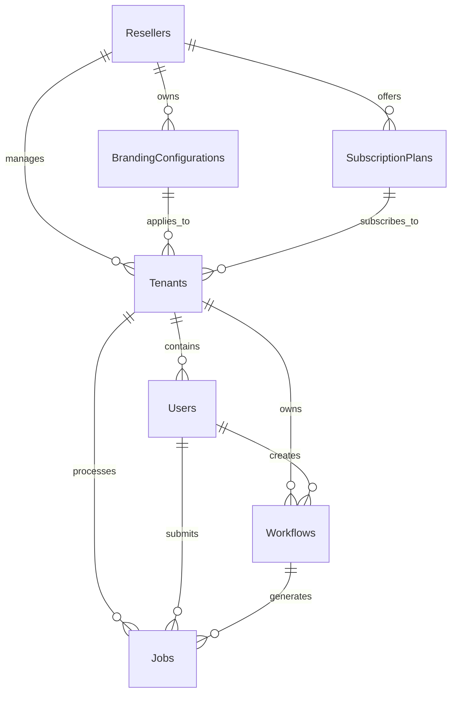

# Multi-Tenant Database Schema Design

This document outlines the database schema design for the multi-tenant implementation of Whisper-WebUI with reseller panel functionality.

## Entity Relationship Diagram



## Tables

### Resellers

Stores information about resellers who manage multiple tenants.

| Column | Type | Description |
|--------|------|-------------|
| id | UUID | Primary key |
| name | VARCHAR(255) | Reseller company name |
| email | VARCHAR(255) | Primary contact email |
| phone | VARCHAR(50) | Contact phone number |
| commission_rate | DECIMAL(5,2) | Commission percentage |
| status | VARCHAR(50) | Active, Suspended, etc. |
| created_at | TIMESTAMP | Creation timestamp |
| updated_at | TIMESTAMP | Last update timestamp |

### Tenants

Stores information about customer organizations (tenants).

| Column | Type | Description |
|--------|------|-------------|
| id | UUID | Primary key |
| reseller_id | UUID | Foreign key to Resellers |
| name | VARCHAR(255) | Tenant organization name |
| domain | VARCHAR(255) | Custom domain (optional) |
| subscription_plan_id | UUID | Foreign key to SubscriptionPlans |
| subscription_id | VARCHAR(255) | RevenueCat subscription ID |
| subscription_status | VARCHAR(50) | Active, Trial, Expired, etc. |
| branding_configuration_id | UUID | Foreign key to BrandingConfigurations |
| storage_quota_mb | INTEGER | Storage quota in MB |
| processing_quota_minutes | INTEGER | Processing quota in minutes |
| created_at | TIMESTAMP | Creation timestamp |
| updated_at | TIMESTAMP | Last update timestamp |

### Users

Stores information about users within each tenant.

| Column | Type | Description |
|--------|------|-------------|
| id | UUID | Primary key |
| tenant_id | UUID | Foreign key to Tenants |
| email | VARCHAR(255) | User email (unique) |
| password_hash | VARCHAR(255) | Hashed password |
| first_name | VARCHAR(100) | First name |
| last_name | VARCHAR(100) | Last name |
| role | VARCHAR(50) | Admin, User, etc. |
| status | VARCHAR(50) | Active, Suspended, etc. |
| last_login | TIMESTAMP | Last login timestamp |
| created_at | TIMESTAMP | Creation timestamp |
| updated_at | TIMESTAMP | Last update timestamp |

### Workflows

Stores workflow configurations created by users.

| Column | Type | Description |
|--------|------|-------------|
| id | UUID | Primary key |
| tenant_id | UUID | Foreign key to Tenants |
| user_id | UUID | Foreign key to Users |
| name | VARCHAR(255) | Workflow name |
| description | TEXT | Workflow description |
| config | JSONB | Workflow configuration (nodes, edges, etc.) |
| is_template | BOOLEAN | Whether this is a template |
| is_public | BOOLEAN | Whether this is shared within tenant |
| created_at | TIMESTAMP | Creation timestamp |
| updated_at | TIMESTAMP | Last update timestamp |

### Jobs

Stores information about transcription jobs.

| Column | Type | Description |
|--------|------|-------------|
| id | UUID | Primary key |
| tenant_id | UUID | Foreign key to Tenants |
| user_id | UUID | Foreign key to Users |
| workflow_id | UUID | Foreign key to Workflows |
| status | VARCHAR(50) | Queued, Processing, Completed, Failed |
| file_path | VARCHAR(255) | Path to input file |
| result_path | VARCHAR(255) | Path to result files |
| error | TEXT | Error message if failed |
| processing_time | INTEGER | Processing time in seconds |
| created_at | TIMESTAMP | Creation timestamp |
| updated_at | TIMESTAMP | Last update timestamp |
| completed_at | TIMESTAMP | Completion timestamp |

### SubscriptionPlans

Stores information about available subscription plans.

| Column | Type | Description |
|--------|------|-------------|
| id | UUID | Primary key |
| reseller_id | UUID | Foreign key to Resellers (NULL for system plans) |
| name | VARCHAR(100) | Plan name (Basic, Premium, etc.) |
| description | TEXT | Plan description |
| price_monthly | DECIMAL(10,2) | Monthly price |
| price_yearly | DECIMAL(10,2) | Yearly price |
| storage_quota_mb | INTEGER | Storage quota in MB |
| processing_quota_minutes | INTEGER | Processing quota in minutes |
| max_users | INTEGER | Maximum number of users |
| features | JSONB | Available features |
| created_at | TIMESTAMP | Creation timestamp |
| updated_at | TIMESTAMP | Last update timestamp |

### BrandingConfigurations

Stores branding configurations for tenants.

| Column | Type | Description |
|--------|------|-------------|
| id | UUID | Primary key |
| reseller_id | UUID | Foreign key to Resellers |
| name | VARCHAR(100) | Configuration name |
| is_default | BOOLEAN | Whether this is the default configuration |
| theme | JSONB | Theme configuration (colors, fonts, etc.) |
| assets | JSONB | Asset URLs (logo, favicon, etc.) |
| texts | JSONB | Custom text content |
| created_at | TIMESTAMP | Creation timestamp |
| updated_at | TIMESTAMP | Last update timestamp |

### UsageRecords

Tracks resource usage for billing purposes.

| Column | Type | Description |
|--------|------|-------------|
| id | UUID | Primary key |
| tenant_id | UUID | Foreign key to Tenants |
| user_id | UUID | Foreign key to Users |
| job_id | UUID | Foreign key to Jobs (optional) |
| resource_type | VARCHAR(50) | Storage, Processing, etc. |
| amount | DECIMAL(10,2) | Amount used |
| unit | VARCHAR(20) | MB, Minutes, etc. |
| recorded_at | TIMESTAMP | When usage was recorded |

### ApiKeys

Stores API keys for programmatic access.

| Column | Type | Description |
|--------|------|-------------|
| id | UUID | Primary key |
| tenant_id | UUID | Foreign key to Tenants |
| user_id | UUID | Foreign key to Users (optional) |
| name | VARCHAR(100) | Key name/description |
| key_hash | VARCHAR(255) | Hashed API key |
| permissions | JSONB | Specific permissions |
| expires_at | TIMESTAMP | Expiration timestamp (optional) |
| last_used_at | TIMESTAMP | Last usage timestamp |
| created_at | TIMESTAMP | Creation timestamp |

## Indexes

For optimal query performance, the following indexes should be created:

1. `tenants_reseller_id_idx` on `Tenants(reseller_id)`
2. `users_tenant_id_idx` on `Users(tenant_id)`
3. `users_email_idx` on `Users(email)`
4. `workflows_tenant_id_idx` on `Workflows(tenant_id)`
5. `workflows_user_id_idx` on `Workflows(user_id)`
6. `jobs_tenant_id_idx` on `Jobs(tenant_id)`
7. `jobs_user_id_idx` on `Jobs(user_id)`
8. `jobs_workflow_id_idx` on `Jobs(workflow_id)`
9. `jobs_status_idx` on `Jobs(status)`
10. `branding_configurations_reseller_id_idx` on `BrandingConfigurations(reseller_id)`
11. `subscription_plans_reseller_id_idx` on `SubscriptionPlans(reseller_id)`
12. `usage_records_tenant_id_idx` on `UsageRecords(tenant_id)`
13. `api_keys_tenant_id_idx` on `ApiKeys(tenant_id)`

## Tenant Isolation

To ensure proper tenant isolation, all queries must include tenant_id filters. For example:

```sql
-- Example of a tenant-isolated query
SELECT * FROM jobs 
WHERE tenant_id = '123e4567-e89b-12d3-a456-426614174000'
AND user_id = '123e4567-e89b-12d3-a456-426614174001';
```

## Migration Strategy

The migration from the current single-tenant schema to the multi-tenant schema will involve:

1. Creating the new tables
2. Adding tenant_id to existing tables
3. Creating a default tenant for existing data
4. Migrating existing users to the default tenant
5. Updating application code to include tenant context in all queries

## Next Steps

1. Create SQL migration scripts for each table
2. Implement database access layer with tenant context
3. Create utility functions for common tenant-aware queries
